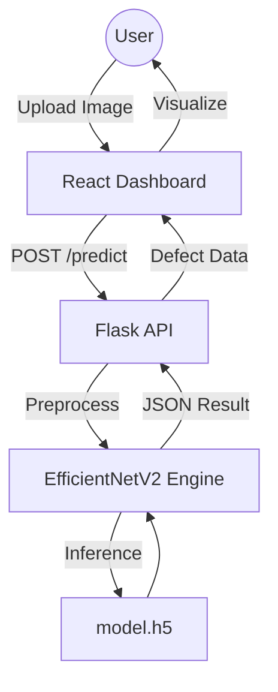

# Project Structure: Steel-Defect-Ai

This document provides a detailed overview of the project's folder hierarchy and the purpose of each component.

## 📁 Root Directory

| Folder/File | Purpose |
|---|---|
| `backend/` | Python/Flask API server. |
| `frontend/` | React.js dashboard application. |
| `model/` | ML model weights, metadata, and training reports. |
| `scripts/` | Standalone Python scripts for training and prediction. |
| `dataset/` | (Ignored) Local storage for training images. |
| `assets/` | Project media, screenshots, and diagrams. |
| `uploads/` | (Ignored) Temporary image uploads. |
| `utils/` | Shared utility functions (future). |

## 📂 backend/
- `app.py`: Main entry point. Flask server with endpoints for prediction and health.
- `requirements.txt`: Python dependencies for the API.
- `.env.example`: Configuration template for the backend.

## 📂 frontend/
- `src/App.js`: Main application logic.
- `src/index.css`: Global design system and professional styling.
- `package.json`: Frontend dependencies and scripts.
- `public/`: Static assets and HTML entry point.

## 📂 model/
- `model.h5`: The finalized Keras model weights.
- `model_meta.json`: JSON file containing class names and accuracy stats.
- `confusion_matrix.png`: Evaluation report from the latest training run.
- `training_history.png`: Loss and accuracy curves.

## 📂 scripts/
- `train.py`: The Grandmaster training pipeline (EfficientNetV2-S).
- `predict.py`: CLI-based inference script for local testing.
- `organize_dataset.py`: Utility to prepare the NEU-DET dataset.

## 🏗️ Architecture Diagram

