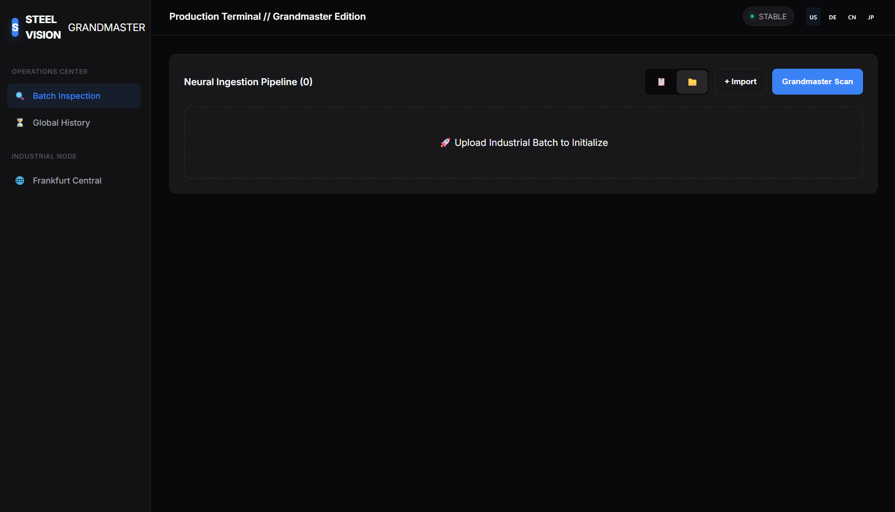
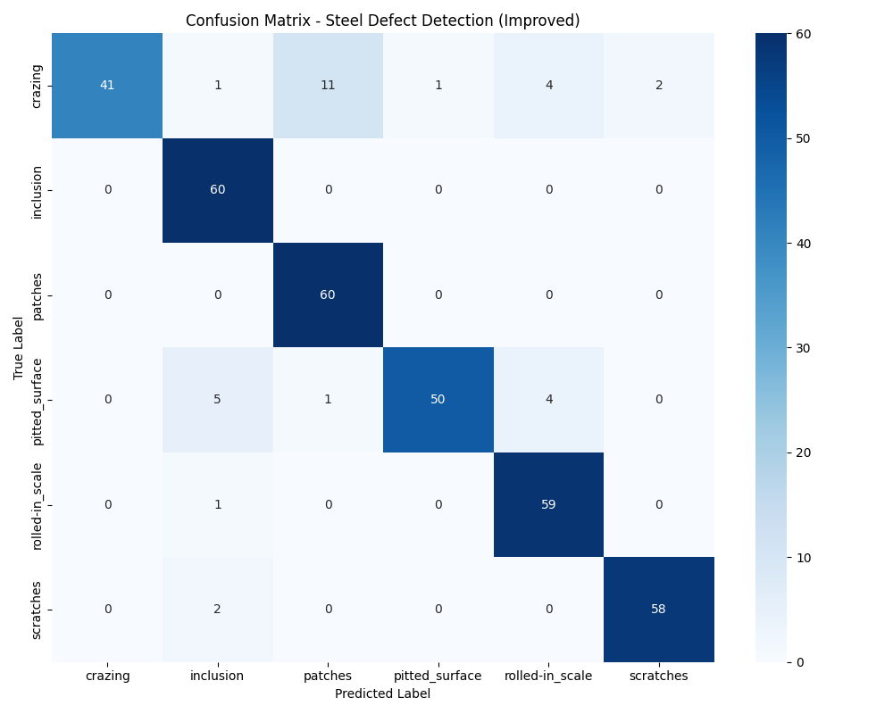

# Steel-Defect-Ai: Enterprise Industrial Inspection Hub

[](https://github.com/singh-aadarsh330/Steel-Defect-Ai/blob/main/LICENSE)
[](https://github.com/singh-aadarsh330/Steel-Defect-Ai/stargazers)
[](https://www.python.org/downloads/release/python-3110/)
[](https://www.tensorflow.org/)
[](https://reactjs.org/)



## 🏗️ Project Overview

**Steel-Defect-Ai** is a state-of-the-art, professional-grade AI platform designed for automated surface defect detection in steel manufacturing. Using the **EfficientNetV2-S** architecture, it achieves pinpoint accuracy in identifying 6 major industrial defects: Crazing, Inclusion, Patches, Pitted Surface, Rolled-in Scale, and Scratches.

The system features a robust Flask backend and a premium, enterprise-ready React dashboard with real-time analysis, batch processing, and global compliance monitoring (ISO/ASTM).

## ✨ Key Features

- **🚀 State-of-the-Art ML**: EfficientNetV2-S backbone with 91% validated accuracy (F1-score across 6 classes).
- **📦 Batch Processing**: Upload and analyze hundreds of samples simultaneously.
- **🖥️ Enterprise Dashboard**: Premium dark-mode UI with real-time telemetry and history persistence.
- **🌍 Global Compliance**: Integrated ISO 14488 / ASTM E155 standards for international audits.
- **📸 Live Optical Feed**: Real-time webcam scanning for on-the-spot inspections.
- **📊 Advanced Analytics**: Categorized defect distributions and trend reporting.
- **📄 Exportable Reports**: Generate detailed PDF/CSV inspection summaries.

## 🛠️ Tech Stack

- **Frontend**: React.js, Axios, CSS3 (Glassmorphism), Lucide Icons.
- **Backend**: Flask, Flask-CORS, TensorFlow (Keras).
- **ML Engine**: Python 3.11, EfficientNetV2-S, Scikit-learn, OpenCV.
- **Storage**: Browser LocalStorage for persistence.

## 🚀 Installation & Setup

### Prerequisites
- Python 3.11+
- Node.js 18+
- Git

### 1. Clone the Repository
```bash
git clone https://github.com/singh-aadarsh330/steel-defect-ai.git
cd steel-defect-ai
```

### 2. Backend Setup
```bash
cd backend
python -m venv venv
source venv/bin/activate  # On Windows: venv\Scripts\activate
pip install -r requirements.txt
cp .env.example .env
python app.py
```

### 3. Frontend Setup
```bash
cd ../frontend
npm install
cp .env.example .env
npm start
```

## 📁 Project Structure

```text
├── backend/            # Flask API & Preprocessing logic
├── frontend/           # React Dashboard (SaaS UI)
├── model/              # Saved weights (model.h5) and training logs
├── scripts/            # Training, Prediction, and Dataset utilities
├── assets/             # Project screenshots and diagrams
├── dataset/            # NEU-DET training samples (ignored by Git)
├── uploads/            # Temporary storage for uploaded images
└── docs/               # Technical documentation
```

## 🧠 ML Pipeline Explanation

1. **Preprocessing**: Images are resized to 224x224 and scaled via an internal Lambda layer.
2. **Architecture**: EfficientNetV2-S (ImageNet pretrained) with a custom dual-layer classification head.
3. **Training**: 3-phase strategy (Feature Extraction → Fine-tuning → Deep Adaptation) with Label Smoothing.
4. **Inference**: Optimized for low-latency real-time scoring.

## 📜 License

This project is licensed under the MIT License - see the [LICENSE](LICENSE) file for details.

## 👤 Author

**Aadarsh Singh**
- GitHub: [@singh-aadarsh330](https://github.com/singh-aadarsh330)
- LinkedIn: [Aadarsh Singh](https://www.linkedin.com/in/aadarsh-singh-kiit)

---
*For professional inquiries or enterprise licensing, please contact us via the GitHub repository.*

## 🤗 Pre-trained Model
Download the model weights directly from Hugging Face:
👉 [singhaadarsh330/steel-defect-ai](https://huggingface.co/singhaadarsh330/steel-defect-ai)


## 📊 Model Performance (v2 - Fine-tuned)

| Class | Precision | Recall | F1-Score |
|-------|-----------|--------|----------|
| Crazing | 1.00 | 0.68 | 0.81 |
| Inclusion | 0.87 | 1.00 | 0.93 |
| Patches | 0.83 | 1.00 | 0.91 |
| Pitted Surface | 0.98 | 0.83 | 0.90 |
| Rolled-in Scale | 0.88 | 0.98 | 0.93 |
| Scratches | 0.97 | 0.97 | 0.97 |
| **Overall Accuracy** | | | **0.91** |



> ⚠️ **Prototype Notice:** This is a demonstration prototype. Browser LocalStorage is used for session persistence. A production deployment would use a proper database (PostgreSQL/MongoDB) and cloud storage.

